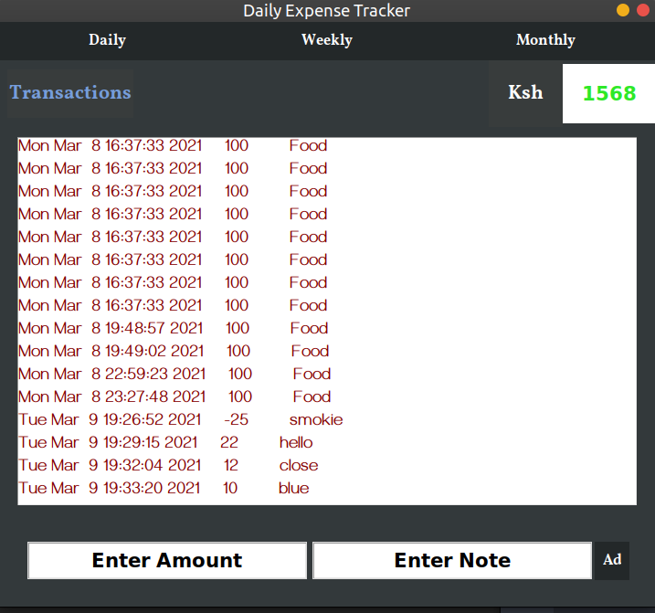

# Daily Expense Tracker

#### This is a GUI App made using Python's Module Tkinter.
#### The app starts with an initial amount of cash and records any transaction which is added or subtracted to the initial amount.

#### Every transaction has to be entered with an accompanying note for clarity of transactions.
<br/>
<br/>
<br/>





#### The app doesn't require additional packages. As long as python is installed to the machine.

## How to use:

#### Navigate to the project and run:
```python
python app.py

```

<br/> 

#### In case you are using Linux or mac, Run:
```python3
python3 app.py
```